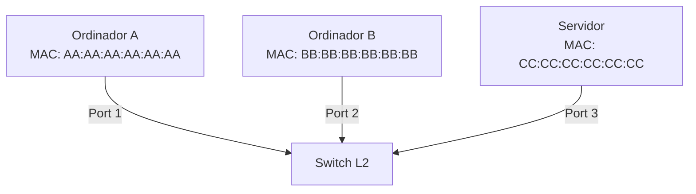
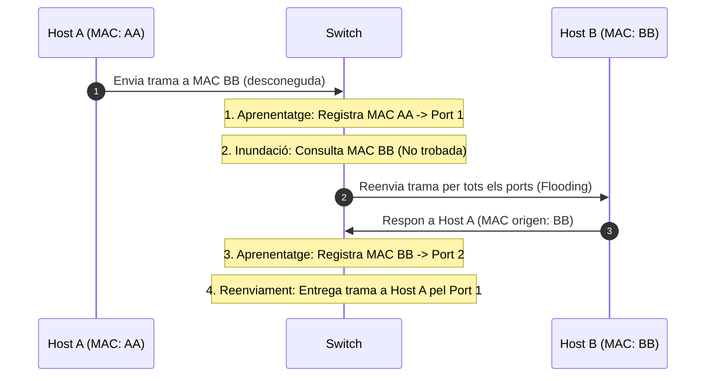
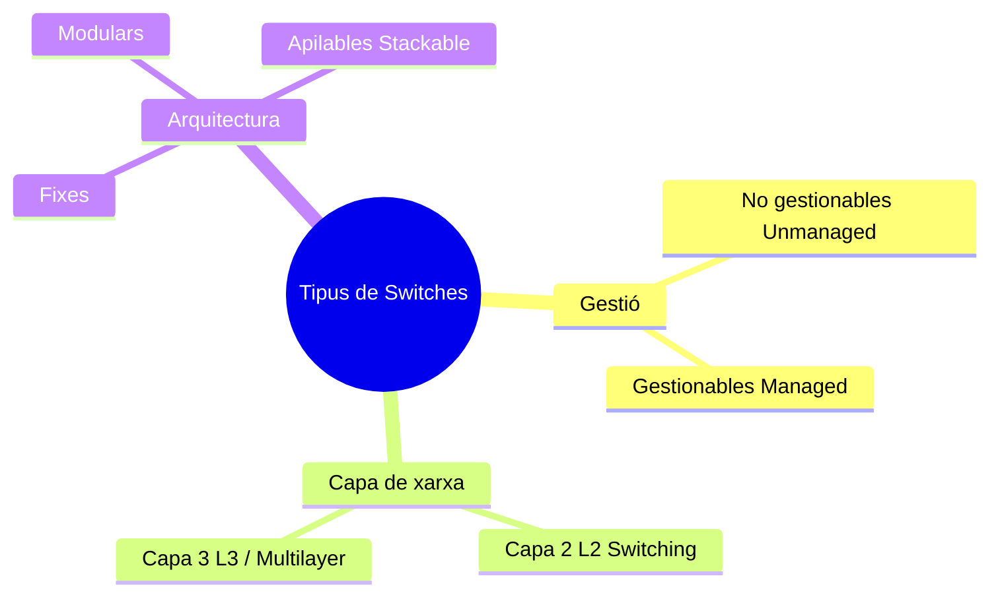
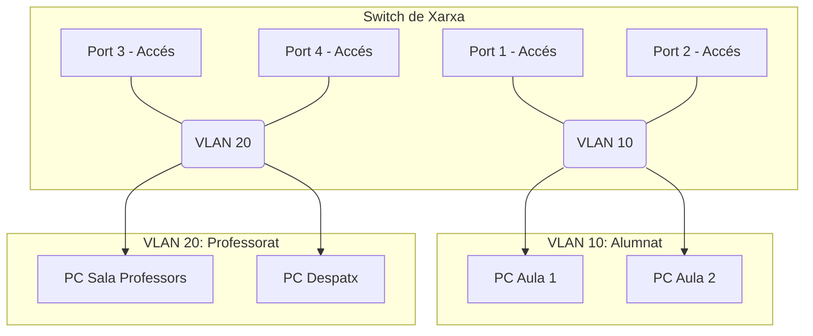
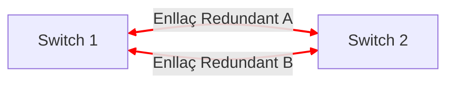
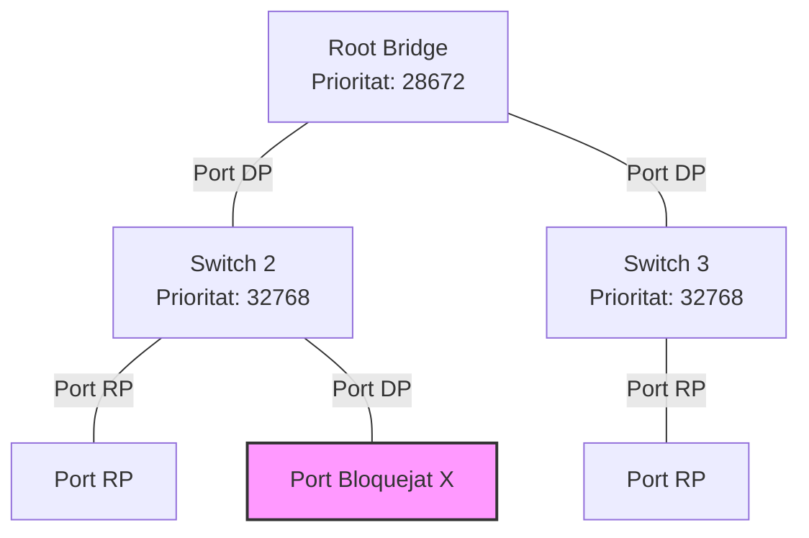

# Unitat Didàctica: Switches (Commutadors) i Xarxes Virtuals (VLANs)

## 1. Introducció i Funcionament del Switch

Un **switch** (o commutador) és un dispositiu d'interconnexió de xarxa que opera principalment a la **Capa 2 (Enllaç de Dades)** del model OSI. La seva funció principal és connectar dispositius en una xarxa d'àrea local (LAN) i dirigir el tràfic de dades directament des de l'origen cap al destí utilitzant les adreces físiques (**MAC - Media Access Control**).



### 1.1 Domini de Col·lisió vs. Domini de Difusió

* **Domini de col·lisió:** Segment de xarxa on dos o més dispositius poden enviar dades al mateix temps i provocar una col·lisió. Un switch **aïlla els dominis de col·lisió en cada un dels seus ports**. Si un switch té 24 ports, crea 24 dominis de col·lisió independents.
* **Domini de difusió (*Broadcast Domain*):** Àrea de la xarxa on qualsevol dispositiu pot enviar una trama de broadcast (destinada a `FF:FF:FF:FF:FF:FF`) i tots els altres dispositius la rebran. Per defecte, tots els ports d'un switch pertanyen al **mateix domini de difusió**.

> **Consell Clau:** Els hubs (concentradors vells) tenen 1 sol domini de col·lisió i 1 domini de difusió. Els switches tenen 1 domini de col·lisió per port i 1 domini de difusió per defecte (si no s'usen VLANs).

---

### 1.2 La Taula d'Adreces MAC (CAM Table)

El switch pren decisions de reenviament consultant la seva **taula d'adreces MAC** (també coneguda com a *Content Addressable Memory* o *CAM Table*). Aquesta taula associa cada port del switch amb l'adreça MAC del dispositiu connectat a ell.

El funcionament de la taula MAC segueix 4 passos fonamentals:

1. **Aprenentatge (*Learning*):** Quan arriba una trama a un port, el switch examina l'**adreça MAC d'origen**. Si aquesta adreça no està a la taula, la guarda associada al port d'entrada juntament amb un temporitzador (*timer*).
2. **Inundació (*Flooding*):** El switch examina l'**adreça MAC de destí**. Si l'adreça de destí és desconeguda (no està a la taula) o és de difusió (*broadcast*), el switch reenvia la trama per **tots els ports excepte el port d'origen**.
3. **Reenviament (*Forwarding*):** Si l'adreça MAC de destí és coneguda i es troba a la taula, el switch reenvia la trama **únicament pel port corresponent**.
4. **Envelliment (*Aging*):** Les entrades de la taula s'eliminen automàticament si no hi ha activitat durant un temps determinat (normalment 300 segons per defecte en equips Cisco).



---

### 1.3 Modes de Reenviament de Trames

Segons com el switch processa la trama abans de reexpedir-la, trobem tres mètodes:

| Mètode | Descripció | Avantatges | Inconvenients |
| :--- | :--- | :--- | :--- |
| **Store-and-Forward** | Rep la trama sencer, verifica el control d'errors (FCS / CRC) i la reenvia si és vàlida. | Descarta trames corruptes o errònies. | Major latència. |
| **Cut-Through** | Llegeix només els primers 6 bytes (MAC destí) i reenvia la trama immediatament. | Latència mínima. | Reenvia trames amb errors. |
| **Fragment-Free** | Llegeix els primers 64 bytes (mida mínima d'una trama Ethernet) abans de reenviar. | Filtra col·lisions (que passen als primer 64 B). | Latència intermèdia. |

---

## 2. Tipus de Switches

Podem classificar els switches segons diferents criteris tècnics:



### 2.1 Segons la capacitat de gestió
* **No gestionables (*Unmanaged*):** Dispositius *Plug-and-Play* d'enllaç directe. No permeten cap mena de configuració, creació de VLANs o monitoratge. S'utilitzen en entorns domèstics o petites oficines (SOHO).
* **Gestionables (*Managed*):** Permeten accedir a una interfície de linia d'ordres (CLI), interfície Web o SNMP per configurar paràmetres avançats (VLANs, seguretat de ports, STP, Link Aggregation, etc.).

### 2.2 Segons la capa del model OSI
* **Switches de Capa 2 (L2):** Commuten trames basant-se exclusivament en adreces MAC. No interpreten adreces IP.
* **Switches de Capa 3 (L3 / Multi-capa):** Poden realitzar funcions de commutació L2 i d'encaminament (*routing*) L3 a nivell de maquinari (ASIC). Permeten interconnectar diferents VLANs sense necessitat d'un router extern (*Inter-VLAN Routing*).

### 2.3 Segons la seva estructura física
* **De configuració fixa:** Reben un nombre concret de ports (ex: 8, 24, 48 ports) que no es poden ampliar.
* **Modulars:** Permeten afegir mòduls de Targetes de Línia (chassis) segons les necessitats de fibra, coure o velocitat.
* **Apilables (*Stackable*):** Es poden interconnectar mitjançant un bus especial de gran velocitat (*StackWise*) per funcionar de manera lògica com un únic switch amb una sola IP de gestió.

---

## 3. Xarxes Virtuals (VLANs - Virtual Local Area Networks)

Una **VLAN** és una agrupació lògica de dispositius de xarxa que permet segmentar un domini de difusió físic en diversos dominis de difusió lògics independents, independentment de la ubicació física dels equips.



### 3.1 Beneficis de l'ús de VLANs
1. **Seguretat:** Aïllament del tràfic entre departaments (ex: els alumnes no tenen accés directe al tràfic dels professors).
2. **Reducció del tràfic de broadcast:** Els missatges de broadcast queden limitats a la mateixa VLAN.
3. **Flexibilitat organitzativa:** Es poden canviar els usuaris de grup lògic sense moure cables de lloc.

---

### 3.2 Tipus de Ports i Etiquetatge (IEEE 802.1Q)

Per connectar dispositius i comunicar switches entre si, s'utilitzen dos tipus de ports:

* **Port d'Accés (*Access Port*):** Pertany a una única VLAN. S'hi connecten equips finals (ordinadors, impressores, telèfons IP). El tràfic circula **sense etiquetar** (*untagged*).
* **Port Tronc (*Trunk Port*):** Connecta switches entre si o un switch amb un router. Pot transportar tràfic de **múltiples VLANs** de manera simultània utilitzant un protocol d'etiquetatge.

#### L'estàndard IEEE 802.1Q
Quan una trama travessa un port tronc, el switch afegeix una etiqueta (*tag*) de **4 bytes** a la capçalera Ethernet que inclou el **VLAN ID (VID)** (valor d'1 a 4094). En arribar al switch destí, l'etiqueta es retira abans de l'entrega al dispositiu final.

```
+-------------------+-------------------+----------------+---------------+
| MAC Destí (6B)    | MAC Origen (6B)   | Tag 802.1Q(4B) | Tipus/Dades   |
+-------------------+-------------------+----------------+---------------+
                                            |
                                            +--> VLAN ID (12 bits)
```

> **VLAN Nativa:** És la VLAN que circula per un enllaç tronc **sense etiquetar**. Per defecte és la VLAN 1. És molt important que la VLAN nativa sigui la mateixa en els dos extrems d'un enllaç tronc.

---

## 4. Spanning Tree Protocol (STP - IEEE 802.1D)

### 4.1 El problema dels bucles de Capa 2
En dissenyar xarxes corporatives és habitual afegir enllaços redundants entre switches per evitar punts únics de fallida (*Single Point of Failure*). Tanmateix, les trames Ethernet de Capa 2 no tenen un camp **TTL (Time to Live)** com el de la capçalera IP de Capa 3.

Si existeix un bucle físic i s'envia una trama de broadcast:
1. Els switches reexpedeixen la trama indefinitament per tots els seus ports.
2. Es produeix una **tempesta de broadcast (*Broadcast Storm*)**, que satura els enllaços i col·lapsa la CPU dels equips.
3. La taula d'adreces MAC es corromp constantment (*MAC Table Instability*).



---

### 4.2 Com funciona el STP?
El protocol **STP (Spanning Tree Protocol - IEEE 802.1D)** detecta i bloqueja de manera lògica els camins redundants per mantenir una topologia lliure de bucles (en forma d'arbre). Si l'enllaç actiu falla, STP reconfigura la xarxa i desbloqueja el camí de reserva.

**Etapes principals del STP:**
1. **Elecció del Bridge Arrel (*Root Bridge*):** El switch amb el **Bridge ID (BID)** més baix (Prioritat + Adreça MAC) es converteix en el centre lògic de la xarxa.
2. **Determinació dels rols de port:**
   * **Root Port (RP):** Port de cada switch no-arrel amb el camí més curt (menys cost) cap al Root Bridge.
   * **Designated Port (DP):** Port encarregat de reenviar tràfic en un segment de xarxa. Tots els ports del Root Bridge son DP.
   * **Alternate / Blocked Port (AP/BP):** Ports que queden en estat de bloqueig per evitar el bucle.



---

## 5. Exemples Pràctics de Configuració en Cisco IOS

### 5.1 Configuració bàsica d'un Switch i IP de gestió (SVI)
```cisco
! Canviar el nom del dispositiu
Switch> enable
Switch# configure terminal
Switch(config)# hostname SW-AULAS

! Configuració de la VLAN de gestió (SVI - Switch Virtual Interface)
SW-AULAS(config)# interface vlan 1
SW-AULAS(config-if)# ip address 192.168.1.254 255.255.255.0
SW-AULAS(config-if)# no shutdown
SW-AULAS(config-if)# exit

! Configuració de la porta d'enllaç per defecte
SW-AULAS(config)# ip default-gateway 192.168.1.1
```

### 5.2 Creació de VLANs i assignació de ports
```cisco
! Creació de les VLANs
SW-AULAS(config)# vlan 10
SW-AULAS(config-vlan)# name ALUMNAT
SW-AULAS(config-vlan)# vlan 20
SW-AULAS(config-vlan)# name PROFESSORAT
SW-AULAS(config-vlan)# exit

! Configurar ports d'accés (FastEthernet 0/1 a 0/10 per a alumnes)
SW-AULAS(config)# interface range fastEthernet 0/1 - 10
SW-AULAS(config-if-range)# switchport mode access
SW-AULAS(config-if-range)# switchport access vlan 10
SW-AULAS(config-if-range)# exit

! Configurar un port Tronc (GigabitEthernet 0/1 cap a un altre switch)
SW-AULAS(config)# interface gigabitEthernet 0/1
SW-AULAS(config-if)# switchport mode trunk
SW-AULAS(config-if)# switchport trunk allowed vlan 10,20
SW-AULAS(config-if)# exit
```

---

## 6. Qüestionari de Repàs

A continuació es presenten 5 preguntes tipus test de repàs. Intenta respondre abans de mirar les solucions explicades al final.

**1. A quina capa del model OSI treballa principalment un switch convencional (L2)?**
- a) Capa 1 - Física
- b) Capa 2 - Enllaç de Dades
- c) Capa 3 - Xarxa
- d) Capa 4 - Transport

**2. Quin és el comportament d'un switch quan rep una trama adreçada a una MAC de destí que no està registrada a la seva taula CAM?**
- a) Descarta la trama immediatament.
- b) Envia la trama únicament a la porta d'enllaç per defecte.
- c) Reenvia la trama per tots els ports excepte el port per on ha entrat (Flooding).
- d) Respon amb un missatge d'error ICMP.

**3. Quin mètode de commutació comença a reenviar la trama just després de llegir l'adreça MAC de destí (els primers 6 bytes)?**
- a) Store-and-Forward
- b) Cut-Through
- c) Fragment-Free
- d) Adaptive Switching

**4. Quin estàndard defineix l'etiquetatge de trames (*tagging*) per a les VLANs en enllaços troncs?**
- a) IEEE 802.11
- b) IEEE 802.3
- c) IEEE 802.1Q
- d) IEEE 802.1D

**5. Quina és la principal funció del protocol Spanning Tree Protocol (STP)?**
- a) Assignar adreces IP automàticament als equips connectats.
- b) Permetre l'encaminament entre diferents VLANs.
- c) Evitar els bucles de Capa 2 en topologies amb enllaços redundants.
- d) Encriptar el tràfic de les VLANs en els ports troncs.

---

### Solucions Explicades del Qüestionari

1. **Resposta correcta: b)** Els switches convencionals (L2) prenen decisions basades en adreces MAC, les quals pertanyen a la Capa 2 (Enllaç de Dades).
2. **Resposta correcta: c)** Quan l'adreça de destí és desconeguda, el switch realitza una inundació (*unicast flooding*) per assegurar-se que el destinatari la rebi.
3. **Resposta correcta: b)** El mètode *Cut-Through* no espera a llegir tota la trama ni comprova el CRC; reenvia la trama de seguida que llegeix l'adreça MAC destí.
4. **Resposta correcta: c)** L'estàndard IEEE 802.1Q afegeix una capçalera de 4 bytes a la trama Ethernet per identificar a quina VLAN pertany. (L'802.1D és per a STP).
5. **Resposta correcta: c)** STP bloca lògicament ports redundants per prevenir les tempestes de broadcast provocades per bucles físics de Capa 2.

---

## 7. Exercicis Pràctics i Supòsits

### Exercici 1: Anàlisi del comportament de la taula MAC
Suposa un switch de 4 ports totalment nou (taula MAC buida). Es connecten 4 ordinadors:
- Port 1: PC-A (MAC `0000.1111.AAAA`)
- Port 2: PC-B (MAC `0000.2222.BBBB`)
- Port 3: PC-C (MAC `0000.3333.CCCC`)
- Port 4: PC-D (MAC `0000.4444.DDDD`)

Descriu què passa a la taula MAC i quins ports reben tràfic en els següents esdeveniments consecutius:
1. El **PC-A** envia un `ping` (ICMP Echo Request) al **PC-C**.
2. El **PC-C** respon al **PC-A** (ICMP Echo Reply).
3. El **PC-B** envia un missatge de broadcast (`FF:FF:FF:FF:FF:FF`).

#### Solució Exercici 1:
1. **Esdeveniment 1:**
   - El switch aprèn la MAC d'origen de PC-A (`0000.1111.AAAA`) i la guarda al **Port 1**.
   - Com que la MAC de destí (`0000.3333.CCCC`) no està a la taula, fa **flooding**: el missatge surt pels **ports 2, 3 i 4**.
2. **Esdeveniment 2:**
   - El switch aprèn la MAC origen de PC-C (`0000.3333.CCCC`) i la guarda al **Port 3**.
   - Com que la MAC de destí de PC-A (`0000.1111.AAAA`) ja està a la taula associada al Port 1, el switch fa **forwarding directat**: la trama surt **únicament pel Port 1**.
3. **Esdeveniment 3:**
   - El switch aprèn la MAC origen de PC-B (`0000.2222.BBBB`) i la guarda al **Port 2**.
   - En ser una adreça de broadcast, el switch la reenvia per tots els ports excepte per on ha entrat: **ports 1, 3 i 4**.

---

### Exercici 2: Disseny de segmentació amb VLANs
Un institut necessita configurar la xarxa d'un edifici amb un switch Cisco. Es demana dissenyar i escriure els comandos CLI per a:
- Crear la **VLAN 10** (nom `ADMINISTRACIO`) i **VLAN 30** (nom `AULES`).
- Configurar els ports `Fa0/1` a `Fa0/5` en la VLAN ADMINISTRACIO.
- Configurar els ports `Fa0/6` a `Fa0/20` en la VLAN AULES.
- Configurar el port `Gi0/1` com a Trunk per connectar amb el router principal.

#### Solució Exercici 2:
```cisco
enable
configure terminal

! 1. Creació de VLANs
vlan 10
 name ADMINISTRACIO
vlan 30
 name AULES
exit

! 2. Assignació de ports d'accés per a Administració
interface range fastEthernet 0/1 - 5
 switchport mode access
 switchport access vlan 10
exit

! 3. Assignació de ports d'accés per a Aules
interface range fastEthernet 0/6 - 20
 switchport mode access
 switchport access vlan 30
exit

! 4. Configuració del port tronc
interface gigabitEthernet 0/1
 switchport mode trunk
 switchport trunk allowed vlan 10,30
exit
```
